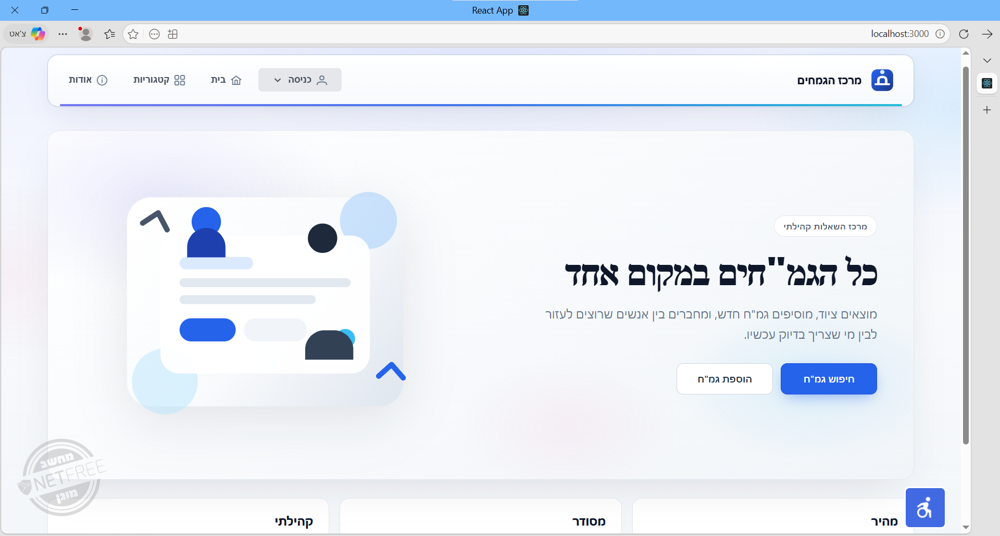
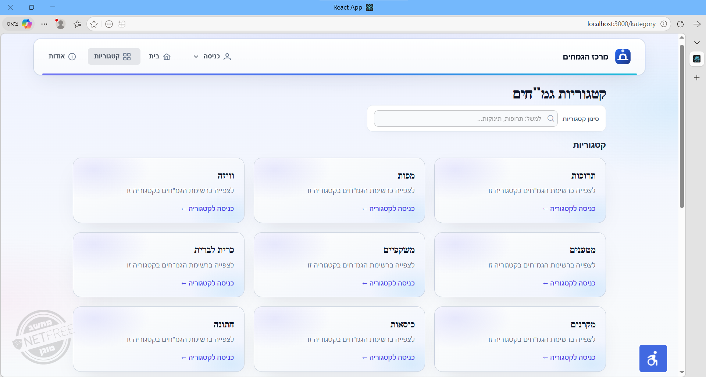
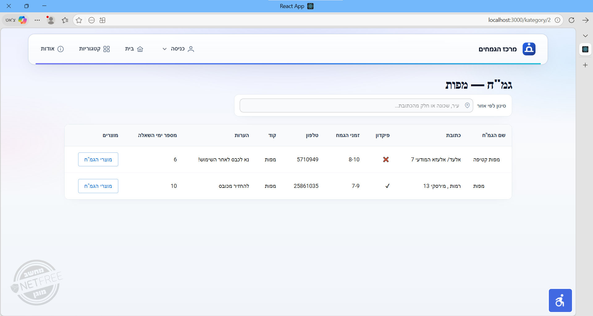
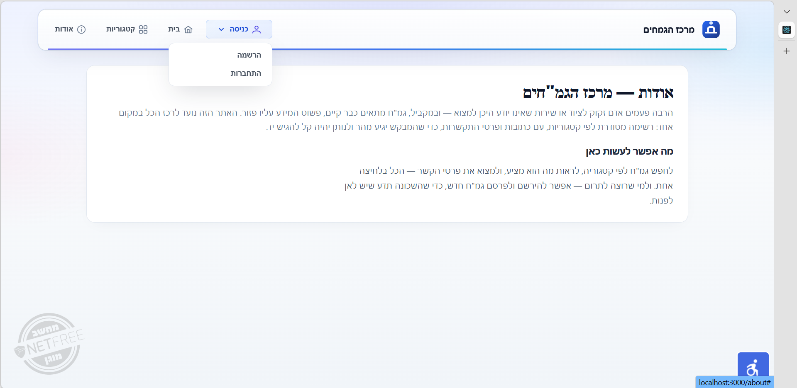
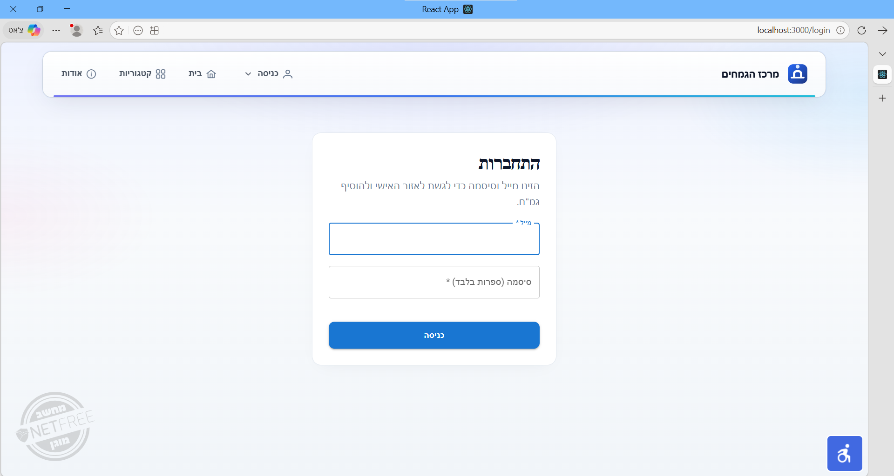
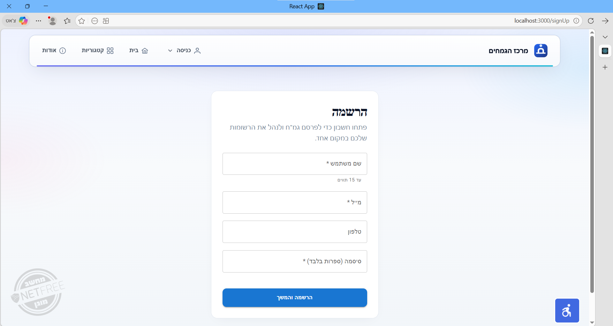
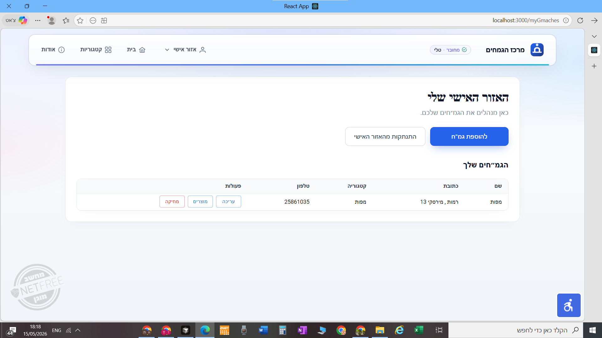
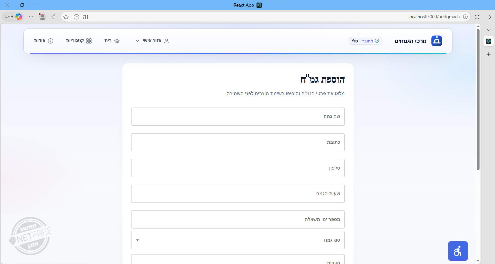

# מרכז הגמחים — פרויקט Full Stack

אפליקציית Web לריכוז וניהול מידע על גמ״חים לפי קטגוריות: צפייה ברשימות ופרטי קשר, סינון והצגת מוצרים לפי גמ״ח, וממשק ניהול (הוספה / עריכה / מחיקה) לאחר התחברות.

---

## Tech Stack

### Frontend

- React (Create React App)
- Redux Toolkit
- Material UI, PrimeReact
- React Router

### Backend

- ASP.NET Core Web API
- Entity Framework Core

### Database

- Microsoft SQL Server

---

## מבנה המאגר

```
final project/
├── init.sql              # סכמת DB וקטגוריות התחלתיות
├── sql/                  # סקריפטים משלימים (כולל מיגרציה לעמודת בעלות)
├── docs/screenshots/     # צילומי מסך (להצגה בגיטהאב)
├── frontend/             # לקוח React
├── c#/                   # פתרון .NET — Web API, BLL, DAL
│   ├── projectC#/        # פרויקט ה־API
│   ├── BLL/
│   └── Dal/
└── README.md
```

---

## דרישות קדם

- [.NET 6 SDK](https://dotnet.microsoft.com/download) (או גרסה תואמת לפרויקט)
- [Node.js](https://nodejs.org/) (LTS) ו־npm
- SQL Server (למשל Express); מסד בשם `gmach` לאחר הרצת הסקריפט (או התאמת מחרוזת החיבור)

---

## הגדרה והרצה מקומית

### 1. מסד נתונים

בשורש המאגר קיים **`init.sql`**: יוצר את מסד `gmach`, את הטבלאות, ומוסיף קטגוריות התחלתיות בלבד (ללא משתמשים אמיתיים).

הסקריפט מיועד להרצה מלאה ב־SQL Server Management Studio או בכלי ניהול דומה מול השרת הרצוי.

קיים גם **`sql/create_database.sql`** (תוכן מקביל). **`sql/alter_gmach_add_owner_email.sql`** — למסדי נתונים קיימים ללא עמודת `custEmail` בטבלת `Gmach`.

נתוני משתמשים, גמ״חים ומוצרים נוצרים דרך הרשמה והממשק.

### 2. Backend — מחרוזת חיבור ואבטחה

עריכת מחרוזת החיבור ב־`c#/projectC#/appsettings.json`.

ברירת המחדל במאגר: חיבור מקומי עם **Trusted_Connection** (אימות Windows). דוגמה ל־SQL Express:

`Server=.\\SQLEXPRESS;Database=gmach;Trusted_Connection=True;TrustServerCertificate=True`

תבנית להעתקה: **`c#/projectC#/appsettings.example.json`** → `appsettings.json` בסביבה חדשה.

חיבור עם משתמש וסיסמת SQL: להימנע מקומיט של סודות; מומלץ [User Secrets](https://learn.microsoft.com/aspnet/core/security/app-secrets) או `appsettings.*.local.json` (מוזכר ב־`.gitignore`).

### 3. הרצת ה־API

```bash
cd c#/projectC#
dotnet run
```

כתובות ברירת מחדל נפוצות: `https://localhost:7223/api` ו־`http://localhost:5118/api` (לפרטים: `frontend/src/config/apiBase.js`).

### 4. הרצת ה־Frontend

```bash
cd frontend
npm install
npm start
```

האפליקציה נפתחת בדרך כלל ב־`http://localhost:3000`.

דריסת כתובת ה־API — קובץ `.env` בתיקיית `frontend`:

```env
REACT_APP_API_URL=https://localhost:YOUR_PORT/api
REACT_APP_API_HTTP_URL=http://localhost:YOUR_HTTP_PORT/api
```

### בניית Frontend לפרודקשן

```bash
cd frontend
npm run build
```

פלט: `frontend/build/`.

---

## צילומי מסך

נתיבי תמונה יחסיים לשורש המאגר (מתאימים לתצוגה בגיטהאב).

<p align="center">
  
</p>

| דף קטגוריות | רשימת גמ״חים בקטגוריה |
|:-----------:|:---------------------:|
|  |  |
|  | |

משתמש מחובר — הרשמה, התחברות ואזור אישי:

| התחברות | הרשמה |
|:-------:|:-----:|
|  |  |
|  | |

הוספת גמ״ח:

<p align="center">
  
</p>

---

## פריסה (Deployment)

הפרויקט כולל **Frontend + Backend + SQL**. פריסת Frontend בלבד תציג ממשק, אך קריאות API ייכשלו כל עוד לא הוגדרה כתובת שרת ציבורית במשתני הסביבה של הלקוח.

**Frontend (למשל Vercel / Netlify)**

- תיקיית שורש לבנייה: `frontend`
- פקודה: `npm run build`
- תיקיית פלט: `build`
- `frontend/public/_redirects` ו־`frontend/vercel.json` תומכים ב־React Router (ריענון דף).

**Backend ומסד נתונים**

פריסה מלאה דורשת אירוח של ASP.NET Core ושל SQL Server (או תואם) בענן — למשל Azure App Service יחד עם Azure SQL — ועדכון `REACT_APP_API_URL` (ו־HTTP במידת הצורך) לכתובת ה־API הציבורית.

---

## רישיון ושימוש

פרויקט לימודי / תיק עבודות — ניתן להציג במאגר ציבורי ובקורות חיים. סיסמאות, מחרוזות חיבור רגישות וקבצי `appsettings.*.local.json` אינם אמורים להיכלל במאגר (מכוסים ב־`.gitignore`).
